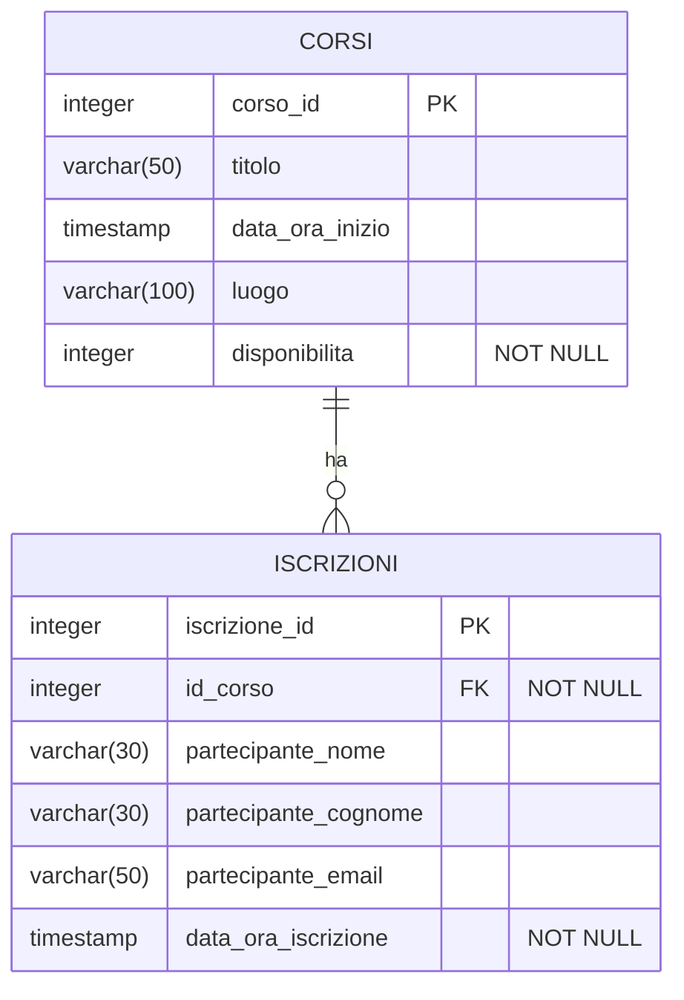

```mermaid
erDiagram
    CORSI{
        integer corso_id PK 
        varchar(50) titolo
        timestamp data_ora_inizio 
        varchar(100) luogo
        integer disponibilita "NOT NULL"
    }
    
    ISCRIZIONI{
        integer iscrizione_id PK
        integer id_corso FK "NOT NULL"
        varchar(30) partecipante_nome
        varchar(30) partecipante_cognome
        varchar(50) partecipante_email
        timestamp data_ora_iscrizione "NOT NULL"
    }
    
    %% Relationships
    CORSI ||--o{ ISCRIZIONI : "ha"
```